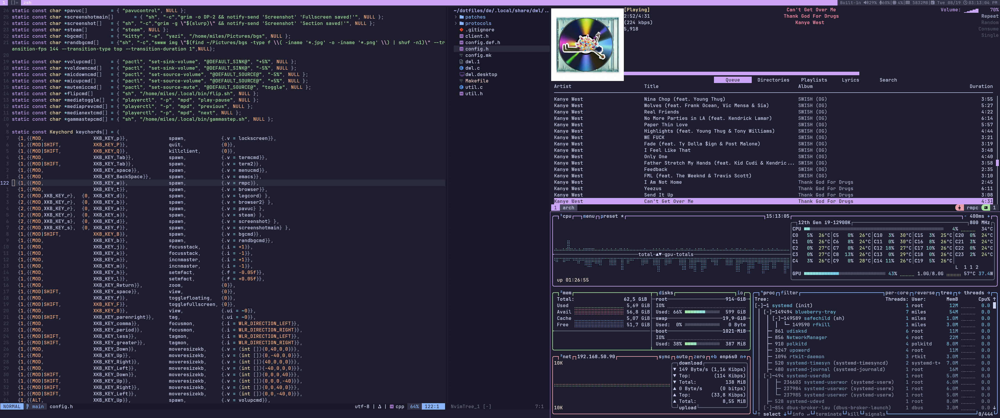
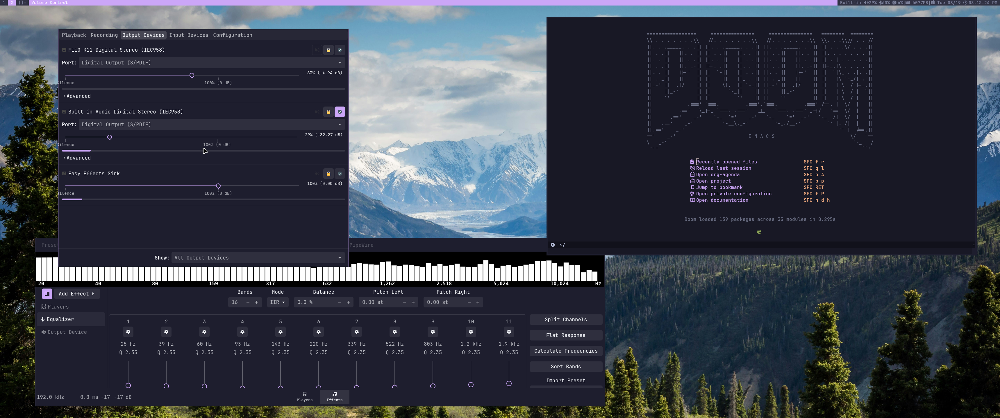
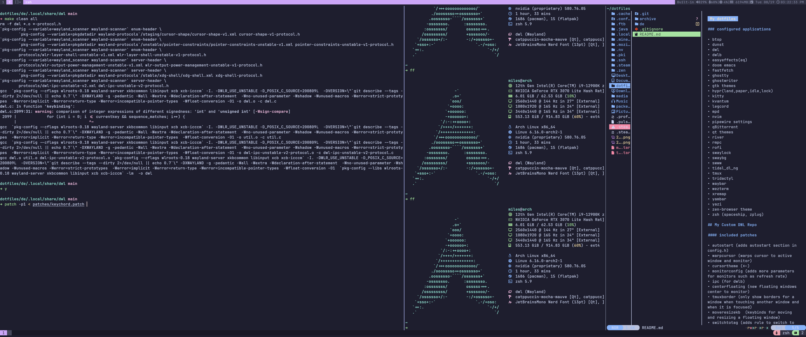

# My dotfiles
## Gallery




### configured applications
* btop
* dunst
* dwl
* dwlb
* easyeffects(eq)
* doom emacs
* fastfetch
* ghostty
* ghostwriter
* gtk themes
* hypr(land,paper,idle,lock)
* kitty
* kvantum
* legcord
* mpd
* nvim
* pipewire settings
* qBittorrent
* qt themes
* river
* rmpc
* rofi
* swaylock
* swaybg
* swww
* tidal_dl_ng
* tmux
* tridactyl
* waybar
* wezterm
* xremap
* yambar
* yazi
* zen-browser theme
* zsh (starship, zplug)

## My Custom DWL Repo
#### included patches
* autostart (adds autostart section in config.h)
* warpcursor (warps cursor to active window and monitor)
* cursortheme (<-)
* monitorconfig (adds more parameters for monitors such as refresh rate)
* ipc (for dwlb)
* centerfloating (new floating windows center to monitor)
* tmuxborder (only show borders for a window when touching another window and when it is focused)
* moveresizekb  (keybinds for moving and resizing a floating window)
* switchtotag (adds rule to switch to tag on window open and switch back on close)
* regexrules (adds regex to dwl rules)
* keepontag (patch i made that makes moving clients between monitors stay on the same tag and view on that monitor. also restores tag on origin monitor to tag 1 if there are no other clients on that tag)
* keychords (adds functionallity for multikey combo like "mod+o" then "t" for opening terminal like in emacs )
* setupenv (adds a array for setting environment variables)

## Install
```
cd ~
git clone https://github.com/zarnuq/dotfiles.git
cd dotfiles
stow de
install.sh
```
