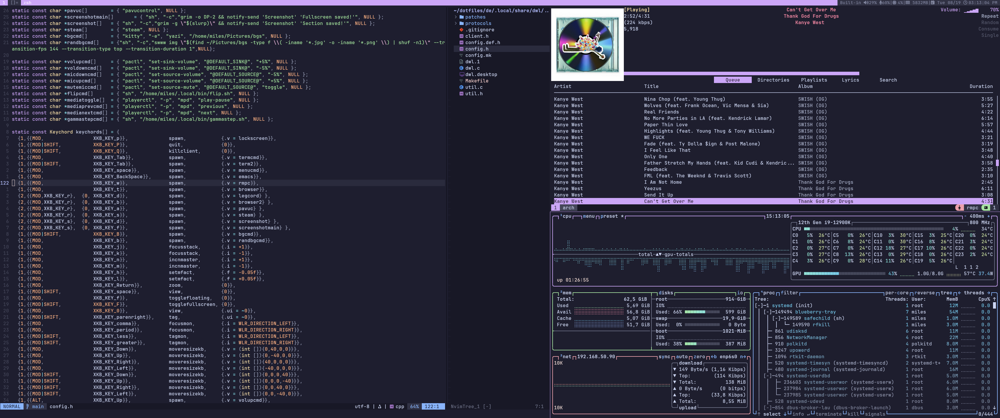
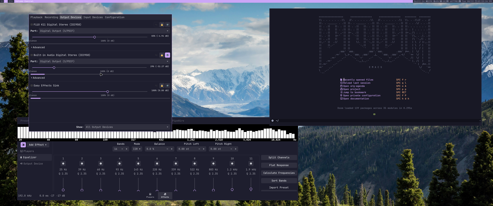
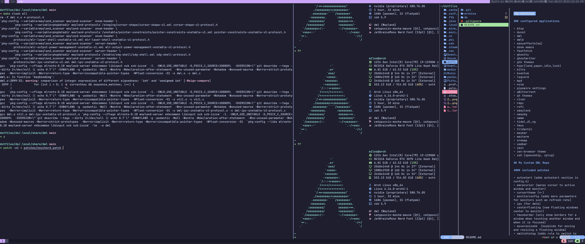

# My dotfiles

## Gallery





# configured applications

- awww
- btop
- doom emacs
- eww
- fastfetch
- gtk themes
- kitty
- kvantum
- mpd
- mako
- nvim
- pipewire settings
- qt themes
- reach(personal wm)
- rmpc
- rofi
- swaylock
- tmux
- yazi
- zen-browser theme
- zsh (spaceship, zplug)

## Install

```
cd ~
git clone https://github.com/zarnuq/dotfiles.git
cd dotfiles
stow de
home-manager switch
```

### reach (window manager)

reach is my window manager (source: https://github.com/zarnuq/reach). On
Gentoo it's packaged in the **zarnuq overlay**:

```
eselect repo add zarnuq git https://github.com/zarnuq/gentoo-overlay.git
emaint sync -r zarnuq
emerge -av gui-wm/reach
```

Config: `~/.config/reach/config.zon` (this repo, stowed); the ebuild also
installs a system default at `/etc/reach/config.zon`.


