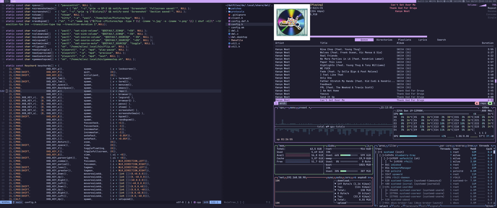
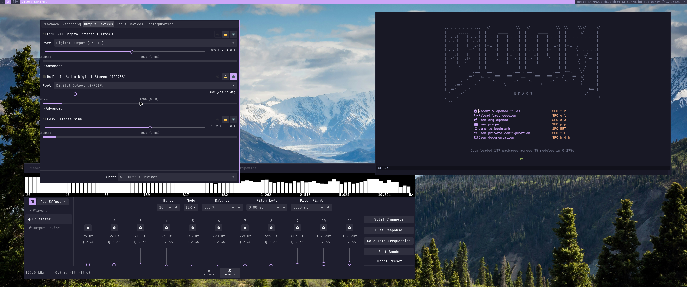
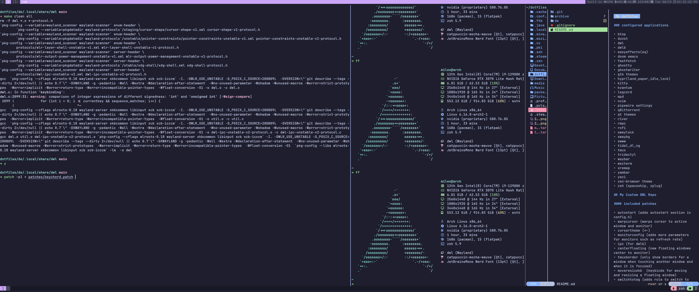

# My dotfiles

## Gallery





## Configured applications

- beets (music library)
- btop
- fastfetch
- gtk themes
- kitty
- kvantum
- mpd
- nvim
- pipewire + wireplumber (16-band EQ sinks)
- qt themes
- quickshell (bar, widgets, launcher, clipboard, lock screen, notifications, wallpaper)
- reach (personal wm)
- tmux
- xdg-desktop-portal
- yazi
- zen-browser theme
- zsh (zplug, zhimmer, vi-mode)

## Install

```
cd ~
git clone https://github.com/zarnuq/dotfiles.git
cd dotfiles
stow de
home-manager switch --flake ~/.config/home-manager#miles
```

`stow -D de` removes the symlinks. The home-manager config is a flake, so plain
`home-manager switch` has nothing to find — the `nixup` alias does a flake
update plus a switch.

### reach (window manager)

reach is my window manager (source: https://github.com/zarnuq/reach). On
Gentoo it's packaged in the **zarnuq overlay**:

```
eselect repo add zarnuq git https://github.com/zarnuq/gentoo-overlay.git
emaint sync -r zarnuq
emerge -av gui-wm/reach
```

Config: `~/.config/reach/config.zon` (this repo, stowed); the ebuild also
installs a system default at `/etc/reach/config.zon`.

### Monitors

`config.zon`'s `.monitors` block holds both machines' layouts — the desktop's
three heads are live and the laptop's are commented out directly above them.
Swap the comments and hit `Super+Shift+r` to reload.

## Quickshell development

The launcher's file search uses `FileIndex.qml` for enumeration and lifecycle,
and `FileSearch.js` for indexing and ranking.

The music window hosts `MusicView.qml`, which composes `MusicHeader`, `MusicQueue`,
`MusicStatusBar` and `MusicOverlay`. `MusicController.qml` owns selection, search,
shortcuts and queue actions through an injected MPD client. Its incremental row
model keeps queue edits from resetting the scroll position.

Run the regression tests with Qt 6 (on Gentoo, `qmltestrunner` is in
`/usr/lib64/qt6/bin`):

```sh
QT_QPA_PLATFORM=offscreen qmltestrunner -input tests/quickshell
```

These tests use synthetic file lists and a fake MPD client; they need no running
desktop session or music server.
After editing a `.pragma library` JavaScript file, restart Quickshell to clear
its cached library: `SVDIR="$HOME/.local/sv" sv restart quickshell`.
